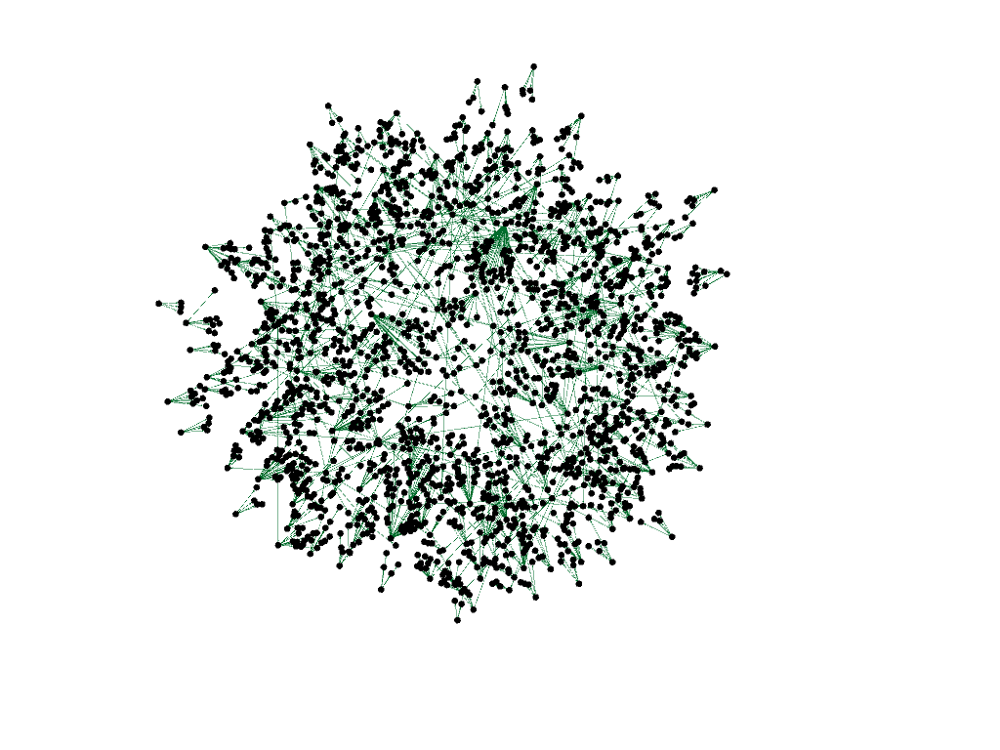

# Bacharelado em Engenharia de Software (Instituto de Informática - UFG)
Informações sobre o Bacharelado em Engenharia de Software (Instituto de Informática - UFG)

Documento em preparação: [aqui](https://docs.google.com/document/d/10Q47cjfuJR_y05nosD47gpDT59VlWbXID-xMI0VDu5s/edit?usp=sharing)

Sem um devido tratamento, o resultado é aquele abaixo, contendo todos os itens de informações e os relacionamentos entre eles.

